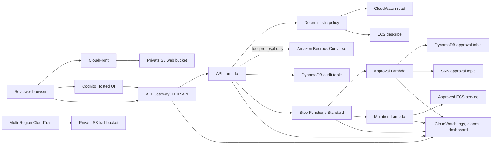

# OpsPilot Architecture

## Two-minute summary

OpsPilot is a safety-first AWS operations assistant. A reviewer signs in through
Amazon Cognito and submits a natural-language request from a static web
interface hosted by CloudFront and a private S3 bucket. API Gateway verifies the
JWT and sends the request to the API Lambda.

For read-only requests, Amazon Bedrock may propose one tool, but it cannot call
AWS services. A deterministic policy validates the proposed tool and arguments
before Boto3 executes one of two allow-listed operations. Destructive prompts
are refused before Bedrock or a tool is called.

For the one controlled mutation, the API starts a Step Functions Standard
workflow. The workflow records the request, sends an SNS approval notification,
waits for a human decision, and invokes a separate mutation Lambda only after
approval. The mutation Lambda starts with `DRY_RUN=true`. The API Lambda and
Step Functions role have no ECS mutation permission.

DynamoDB stores application audit and approval state. CloudWatch provides logs,
alarms, and a dashboard. A multi-Region CloudTrail trail records AWS management
events into a private S3 bucket.

## System diagram

## Trust boundaries

| Boundary | Input | Control |
| --- | --- | --- |
| Browser to API | JWT and request text | Cognito scopes, API Gateway JWT authorizer, request length limit |
| Language model to tools | Proposed tool and arguments | Deterministic allow list; Bedrock has no tool execution capability |
| Read path to AWS | Validated read-only operation | Narrow API Lambda IAM policy |
| Controlled mutation path | Exact controlled request | `opspilot/apply` scope, Step Functions approval, separate mutation role |
| Approval callback | Step Functions task token | Token stored only in DynamoDB, never SNS or browser, removed at final state |
| Operations evidence | Logs, metrics, audit state | Explicit retention, alarms, dashboard, CloudTrail validation |

## Key engineering decisions

1. **Authorization is deterministic.** The model may propose; code decides.
2. **Read and write roles are separated.** The API and workflow orchestrator
   cannot mutate ECS. Only the mutation Lambda can receive `ecs:UpdateService`,
   and only when dry-run mode is disabled with an exact service ARN.
3. **Mutation is asynchronous and human-approved.** Step Functions makes
   pending, approved, rejected, expired, completed, and failed states visible.
4. **Browser responses are sanitized.** The web interface receives no AWS
   credentials, approval task tokens, or raw DynamoDB records.
5. **Workflow logs exclude execution payloads.** Step Functions writes
   error-only operational logs without request data or callback task tokens.
6. **Infrastructure is declared in Terraform.** Application resources, IAM,
   alarms, dashboard, CloudTrail, hosting, and retention are versioned together.

## Repository map

| Path | Responsibility |
| --- | --- |
| `services/api/` | Authenticated request routing, deterministic policy, read tools, safe web API |
| `services/approval/` | Approval state, SNS notification, callback completion |
| `services/mutation/` | One approved controlled action, dry-run by default |
| `web/` | TypeScript Cognito client and reviewer interface |
| `infra/dev/` | Terraform for the complete development application |
| `tests/` | Policy, failure-path, API, workflow, web, and Terraform contracts |
| `.github/workflows/` | Pull-request validation and manual OIDC development deployment |

## Current limitations

- The reference deployment supports two read-only tools and one controlled
  mutation.
- The application stack is deployed in one primary Region; only CloudTrail is
  multi-Region.
- Approval notification is email-oriented. The browser shows status but does
  not provide an approver decision screen.
- The deployment workflow expects a preconfigured GitHub OIDC role in the
  `AWS_DEPLOY_ROLE_ARN` environment variable.
- This is a portfolio development environment, not a production replacement for
  enterprise change management, centralized identity, WAF, SIEM, or on-call.
